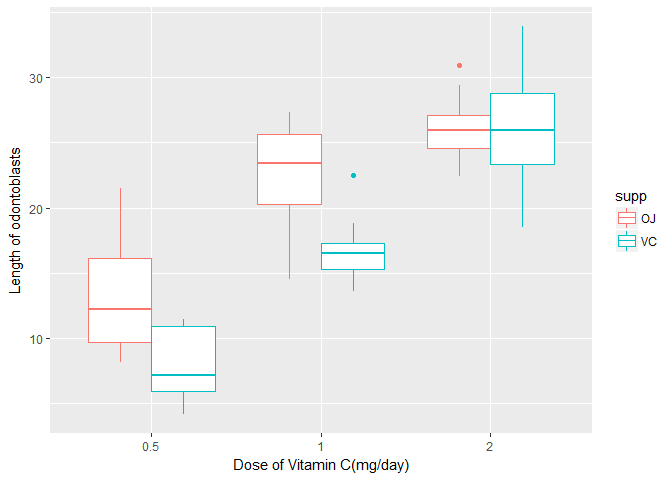
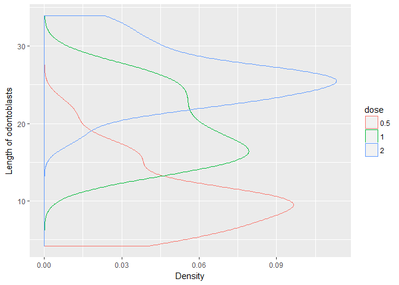

### Project Part 2: Basic Inferential Data Analysis

#### Overview
In the second portion of the project, we're going to analyze the ToothGrowth data in the R datasets package. We have to perform basic exploratory data analysis and summary of data.

#### Loading Libraries and data

```r
library(ggplot2)
```

```
## Warning: package 'ggplot2' was built under R version 3.4.4
```

```r
data(ToothGrowth)
attach(ToothGrowth)
```

#### About Data
The data talks about the Effect of Vitamin C on Tooth Growth in Guinea Pigs

Description:
The response is the length of odontoblasts (cells responsible for tooth growth) in 60 guinea pigs. Each animal received one of three dose levels of vitamin C (0.5, 1, and 2 mg/day) by one of two delivery methods, (orange juice or ascorbic acid (a form of vitamin C and coded as VC).


#### Loking at the basic stats

```r
str(ToothGrowth)
```

```
## 'data.frame':	60 obs. of  3 variables:
##  $ len : num  4.2 11.5 7.3 5.8 6.4 10 11.2 11.2 5.2 7 ...
##  $ supp: Factor w/ 2 levels "OJ","VC": 2 2 2 2 2 2 2 2 2 2 ...
##  $ dose: num  0.5 0.5 0.5 0.5 0.5 0.5 0.5 0.5 0.5 0.5 ...
```


#### Exploratory Data Analysis

We will be plotting a scatterplot to demonstrate the relationship between Tooth Lengths with respect to Dose Levels and Delivery Methods


```r
ToothGrowth$dose<- as.factor(ToothGrowth$dose)
ggplot(ToothGrowth, aes(x= dose, y= len, color= supp)) + geom_boxplot() + xlab("Dose of Vitamin C(mg/day)") + ylab("Length of odontoblasts")
```

<!-- -->


```r
ggplot(ToothGrowth, aes(x= len, color= dose)) + geom_density(alpha=0.5) + coord_flip() + xlab("Length of odontoblasts") + ylab("Density") + scale_fill_manual(values=c("orange","purple"))
```

<!-- -->


#### Loking at the data summary 

```r
summary(ToothGrowth)
```

```
##       len        supp     dose   
##  Min.   : 4.20   OJ:30   0.5:20  
##  1st Qu.:13.07   VC:30   1  :20  
##  Median :19.25           2  :20  
##  Mean   :18.81                   
##  3rd Qu.:25.27                   
##  Max.   :33.90
```

#### Using hypothesis tests to compare tooth growth by supp and dose.

##### Using Supplement Delivery Method As A Factor:

Null Hypothesis: here is no correlation between the Delivery Method and Tooth Length.


```r
t.test(len ~ supp, paired = F, var.equal = F, data = ToothGrowth)
```

```
## 
## 	Welch Two Sample t-test
## 
## data:  len by supp
## t = 1.9153, df = 55.309, p-value = 0.06063
## alternative hypothesis: true difference in means is not equal to 0
## 95 percent confidence interval:
##  -0.1710156  7.5710156
## sample estimates:
## mean in group OJ mean in group VC 
##         20.66333         16.96333
```

As per the above test we gather the inference that the 95% confidence interval is `[-0.1710156, 7.5710156]` and the p-value is `0.06063`(6.06%), which is greater than `0.05`(5%). Hence, the NULL Hypothesis cannont be rejected.

Therfore, from the above statements and inferences we conclude that there is no correlation between Delivery Method and Tooth Length.

##### Using Supplement Dosage Level As A Factor:

Dividing the data based on the dose level:

```r
Dose_1 <- subset(ToothGrowth, dose %in% c(0.5, 1.0))
Dose_2 <- subset(ToothGrowth, dose %in% c(0.5, 2.0))
Dose_3 <- subset(ToothGrowth, dose %in% c(1.0, 2.0))
```

Analyzing the data for correlation between the Dose Level and change in Tooth Growth, assuming unequal variances between the two groups.

NULL Hypothesis: For the following three t-tests, there is no correlation between the Dose Level and Tooth Length.

Testing for Dose level in 0.5 and 1.0

```r
t.test(len ~ dose, paired = F, var.equal = F, data = Dose_1)
```

```
## 
## 	Welch Two Sample t-test
## 
## data:  len by dose
## t = -6.4766, df = 37.986, p-value = 1.268e-07
## alternative hypothesis: true difference in means is not equal to 0
## 95 percent confidence interval:
##  -11.983781  -6.276219
## sample estimates:
## mean in group 0.5   mean in group 1 
##            10.605            19.735
```

Here, the 95% confidence interval is `[-11.983781, -6.276219]`, which does not contain zero and the p-value is `1.268e-07`, which is less than 0.05. Hence, we can safely reject the NULL Hypothesis.

Testing for Dose level in 0.5 and 2.0

```r
t.test(len ~ dose, paired = F, var.equal = F, data = Dose_2)
```

```
## 
## 	Welch Two Sample t-test
## 
## data:  len by dose
## t = -11.799, df = 36.883, p-value = 4.398e-14
## alternative hypothesis: true difference in means is not equal to 0
## 95 percent confidence interval:
##  -18.15617 -12.83383
## sample estimates:
## mean in group 0.5   mean in group 2 
##            10.605            26.100
```

Here, the 95% confidence interval is `[-18.15617, -12.83383]`, which does not contain zero and the p-value is `4.398e-14`, which is less than `0.05`. Hence, we can safely reject the NULL Hypothesis.

Testing for Dose level in 1.0 and 2.0

```r
t.test(len ~ dose, paired = F, var.equal = F, data = Dose_3)
```

```
## 
## 	Welch Two Sample t-test
## 
## data:  len by dose
## t = -4.9005, df = 37.101, p-value = 1.906e-05
## alternative hypothesis: true difference in means is not equal to 0
## 95 percent confidence interval:
##  -8.996481 -3.733519
## sample estimates:
## mean in group 1 mean in group 2 
##          19.735          26.100
```

Here, the 95% confidence interval is `[-8.996481, -3.733519]`, which does not contain zero and the p-value is `1.906e-05`, which is less than `0.05`. Hence, we can safely reject the NULL Hypothesis.

From these three t-tests, we conclude that, There is significant correlation between the Dose Level and Tooth Length.

#### Conclusions:
Increase in Supplement Dose Levels leads to overall increase in Tooth Length.

